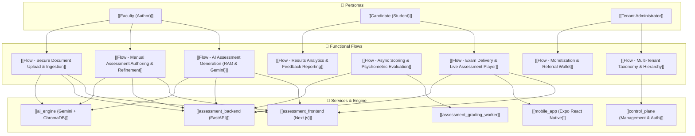

---
tags:
  - moc
  - index
  - architecture
  - vatra-assess
updated: 2026-09-20
---

# 🎓 Vatra Assess Knowledgebase — Functional Flow & Architecture Map

Welcome to the **Vatra Assess Platform** functional flow knowledgebase. This vault documents end-to-end user journeys, microservice interactions, standardized EdTech question models, and automated psychometric evaluation workflows.

---

## 🗺️ Visual Ecosystem Map

---

## 📂 Navigation Index (Maps of Content)

### 1. 👤 [[01 - 👤 Personas/|Personas & Actors]]
- [[Faculty (Author)]] — Assessment creators, educators, and curriculum authors.
- [[Candidate (Student)]] — Test takers across Web and Mobile apps.
- [[Tenant Administrator]] — Institutional operators configuring taxonomies, quotas, and licensing.

---

### 2. 🔄 [[02 - 🔄 Functional Flows/|Core Functional Flows]]
1. **[[Flow - AI Assessment Generation (RAG & Gemini)]]** — Prompt-to-quiz & RAG ingestion with self-correction.
2. **[[Flow - Manual Assessment Authoring & Refinement]]** — 5 standardized question types and interactive review canvas.
3. **[[Flow - Secure Document Upload & Ingestion]]** — Parsing, vector chunking, and tenant-scoped retrieval.
4. **[[Flow - Exam Delivery & Live Assessment Player]]** — Timed exam lobby, deep links, and client-side autosave.
5. **[[Flow - Async Scoring & Psychometric Evaluation]]** — Worker queue, $p$-value difficulty, and $r$-PBIS discrimination.
6. **[[Flow - Results Analytics & Feedback Reporting]]** — Student breakdown, email dispatch, and psychometric reports.
7. **[[Flow - Multi-Tenant Taxonomy & Hierarchy]]** — PostgreSQL `ltree` subject hierarchies and node isolation.
8. **[[Flow - Monetization & Referral Wallet]]** — Wallet balances, credit consumption, and referral incentives.

---

### 3. 🧩 [[03 - 🧩 Components & Services/|Microservices & Architecture]]
- [[assessment_frontend (Next.js)]] (Port 3000)
- [[assessment_backend (FastAPI)]] (Port 8000)
- [[ai_engine (Gemini + ChromaDB)]]
- [[mobile_app (Expo React Native)]]
- [[assessment_grading_worker]]
- [[control_plane (Management & Auth)]] (Port 8001/3001)

---

### 4. 📋 [[04 - 📋 Entities & Patterns/|Standards & Design Patterns]]
- [[Standardized Question Types (EdTech)]] (MCQ_SINGLE, MCQ_MULTIPLE, TEXT_ENTRY, INLINE_CHOICE, NUMERIC_ENTRY)
- [[Transactional Outbox Pattern]]
- [[Psychometric Item Analysis (p-value & r-PBIS)]]
- [[3-Tier LLM Quota Engine]]

---

### 5. 🎨 Interactive Visual Canvases
- Open `05 - 🎨 Canvas/E2E-Assessment-Lifecycle.canvas` for an interactive zoomable board of the entire platform flow.
