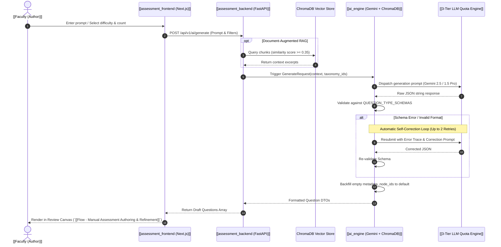

---
tags:
  - flow
  - ai-engine
  - rag
  - gemini
flow_id: FLOW-01
domain: Authoring
primary_persona: "[[Faculty (Author)]]"
services_involved:
  - "[[ai_engine (Gemini + ChromaDB)]]"
  - "[[assessment_backend (FastAPI)]]"
  - "[[assessment_frontend (Next.js)]]"
status: active
---

# 🤖 Flow: AI Assessment Generation (RAG & Gemini)

## 1. Executive Summary
This flow orchestrates automated question generation from either unstructured topic prompts or vector-indexed document chunks. It features strict JSON schema enforcement against 5 EdTech question types, a self-correction feedback loop, and a 3-tier LLM fallback resilience mechanism.

---

## 2. Sequence Diagram

---

## 3. Step-by-Step Functional Walkthrough

### Step 1: Input Calibration
The [[Faculty (Author)]] selects:
- **Generation Mode**: `Quick Gen` (Topic prompt), `Syllabus Blueprint`, or `Document Grounded`.
- **Target Question Types**: `MCQ_SINGLE`, `MCQ_MULTIPLE`, `TEXT_ENTRY`, `INLINE_CHOICE`, `NUMERIC_ENTRY` (see [[Standardized Question Types (EdTech)]]).
- **Taxonomy Binding**: Selects subject nodes from the PostgreSQL `ltree` tree.

### Step 2: RAG Context Assembly
- If uploaded documents exist, chunks with cosine similarity $\ge 0.35$ are retrieved from ChromaDB filtered by `tenant_id` and `creator_id`.

### Step 3: LLM Inference & Resilience
- Handled by [[3-Tier LLM Quota Engine]]:
  1. Primary Gemini Pro API Key
  2. Secondary Key on HTTP 429
  3. Local Ollama (`llama3.2:3b`) fallback
  4. Mock LLM Generator (for zero-outage developer mode)

### Step 4: Schema Validation & 10-Underscore Blank Enforcement
- Free-form (`TEXT_ENTRY`, `NUMERIC_ENTRY`) and dropdown (`INLINE_CHOICE`) questions MUST contain `__________` (exactly 10 underscores).
- `options` MUST be `null` for `TEXT_ENTRY` and `NUMERIC_ENTRY` to prevent API contract violations.
- If validation fails, the error message is fed back into Gemini in an automated self-correction prompt (max 2 retries).

---

## 4. API Endpoints & Contracts
- `POST /api/v1/public/quick-generate` (`QuickGenerateRequest`) — Anonymous topic/mode generation without upfront login (`TemporaryCreator`).
- `POST /api/v1/public/generate` (`GenerateRequest`) — Public prompt & blueprint generation.
- `POST /api/v1/questions/generate` — Authenticated faculty authoring pipeline.
- `POST /api/v1/public/creators/temporary` — Anonymous creator session provisioning.

## 5. Related Links
- Next Step: [[Flow - Manual Assessment Authoring & Refinement]]
- Document Upload Flow: [[Flow - Secure Document Upload & Ingestion]]
- Entities: [[Standardized Question Types (EdTech)]], [[3-Tier LLM Quota Engine]]

