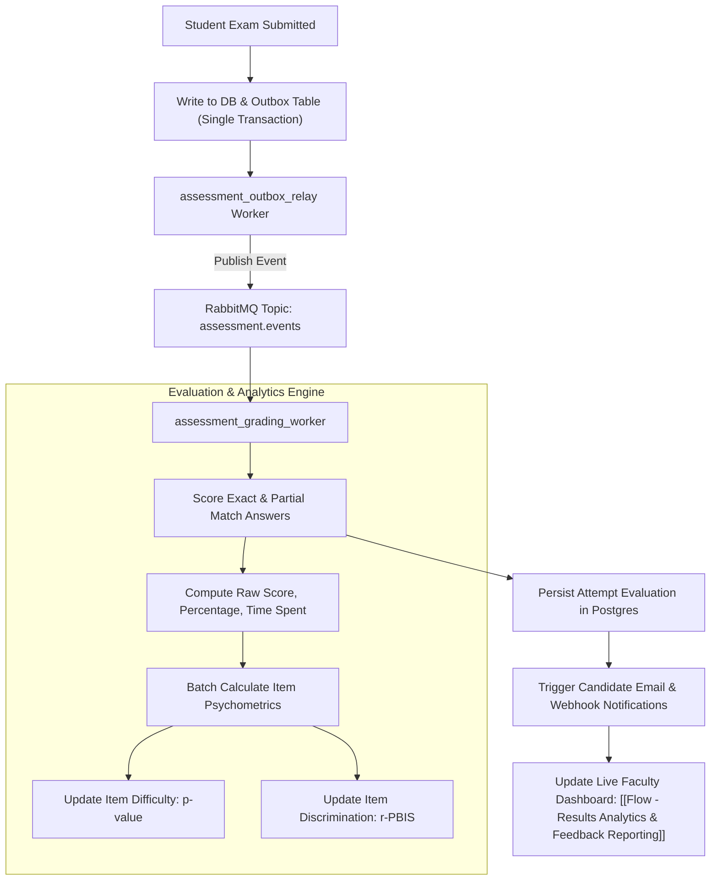

---
tags:
  - flow
  - scoring
  - psychometrics
  - async-worker
flow_id: FLOW-05
domain: Evaluation
primary_persona: "[[Tenant Administrator]]"
services_involved:
  - "[[assessment_grading_worker]]"
  - "[[assessment_backend (FastAPI)]]"
status: active
---

# 📊 Flow: Async Scoring & Psychometric Evaluation

## 1. Executive Summary
Describes how student submissions are scored asynchronously via the Transactional Outbox pattern, evaluating answers against keys, and recalculating live item psychometrics ($p$-value difficulty index and $r$-PBIS point-biserial discrimination).

---

## 2. Architecture & Data Flow

---

## 3. Mathematical Foundations

### 1. Item Difficulty Index ($p$-value)
$$p = \frac{\text{Number of candidates answering correctly}}{\text{Total number of candidate attempts}}$$
- $p \ge 0.85$: Very Easy
- $0.30 \le p \le 0.80$: Ideal Calibration
- $p < 0.30$: Highly Difficult

### 2. Point-Biserial Discrimination ($r$-PBIS)
$$r_{\text{pbis}} = \frac{\bar{X}_1 - \bar{X}_0}{s_X} \sqrt{\frac{N_1 N_0}{N^2}}$$
- Measures whether high-performing students got the question right more often than low-performing students.
- $r \ge 0.30$: Strong discriminator
- $r < 0.15$: Flawed item / Potential distractor ambiguity

---

## 4. Resilience & Error Handling
- **Transactional Outbox**: Guarantees zero lost submission grading events even during broker failover.
- **Idempotency**: Submissions are uniquely identified by `session_id`; reprocessing duplicate events results in safe no-ops.

## 5. Related Links
- Upstream: [[Flow - Exam Delivery & Live Assessment Player]]
- Downstream: [[Flow - Results Analytics & Feedback Reporting]]
- Pattern Details: [[Transactional Outbox Pattern]], [[Psychometric Item Analysis (p-value & r-PBIS)]]
