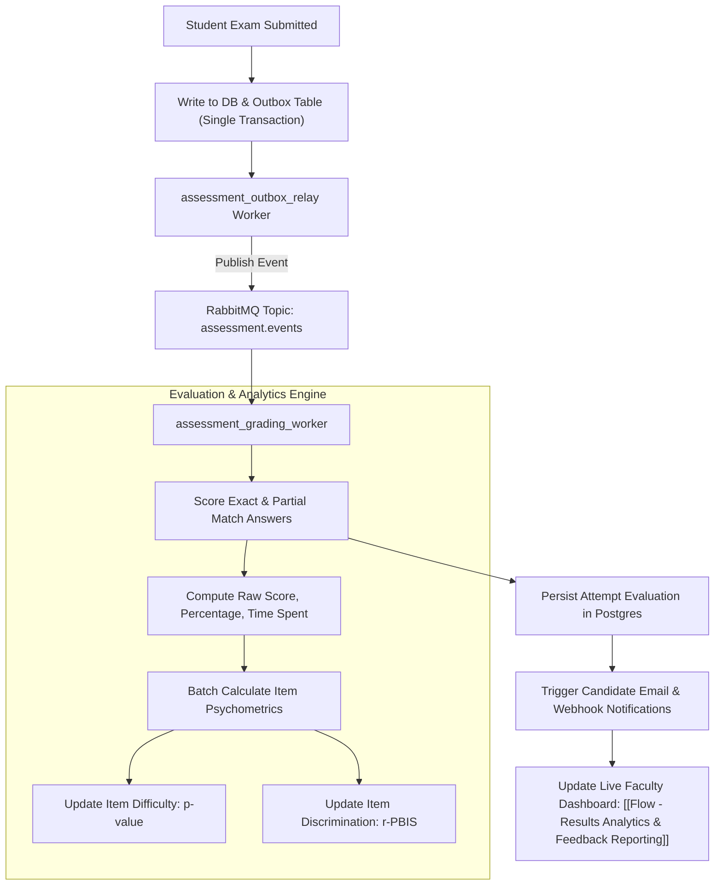

---
tags:
  - flow
  - scoring
  - psychometrics
  - async-worker
flow_id: FLOW-05
domain: Evaluation
primary_persona: "[[Tenant Administrator]]"
services_involved:
  - "[[assessment_grading_worker]]"
  - "[[assessment_backend (FastAPI)]]"
status: active
---

# 📊 Flow: Async Scoring & Psychometric Evaluation

## 1. Executive Summary
Describes how student submissions are scored asynchronously via the Transactional Outbox pattern, evaluating answers against keys, and recalculating live item psychometrics ($p$-value difficulty index and $r$-PBIS point-biserial discrimination).

---

## 2. Architecture & Data Flow



---

## 3. Mathematical Foundations

### 1. Item Difficulty Index ($p$-value)
$$p = \frac{\text{Number of candidates answering correctly}}{\text{Total number of candidate attempts}}$$
- $p \ge 0.85$: Very Easy
- $0.30 \le p \le 0.80$: Ideal Calibration
- $p < 0.30$: Highly Difficult

### 2. Point-Biserial Discrimination ($r$-PBIS)
$$r_{\text{pbis}} = \frac{\bar{X}_1 - \bar{X}_0}{s_X} \sqrt{\frac{N_1 N_0}{N^2}}$$
- Measures whether high-performing students got the question right more often than low-performing students.
- $r \ge 0.30$: Strong discriminator
- $r < 0.15$: Flawed item / Potential distractor ambiguity

---

## 4. Resilience, Worker Idempotency & Psychometric Deduplication

> [!IMPORTANT] **CTO Invariant: Zero-Drift Psychometrics via Idempotency**
> Because RabbitMQ guarantees *at-least-once* delivery, network retries or relay crashes can deliver the same `SUBMISSION_COMPLETED` event multiple times. Without strict deduplication, scoring the same exam attempt twice will corrupt running psychometric totals ($N$, $R$, $\sum X$, $\sum X^2$).

### Idempotency Execution Protocol:
1. **Deduplication Key**: Each incoming event carries a unique `event_id` and `session_id` (or `attempt_id`).
2. **Atomic Lock & Status Check**:
   ```sql
   -- Check if already processed within a serializable transaction
   SELECT status FROM exam_attempts WHERE id = :attempt_id FOR UPDATE;
   ```
   - If `status == 'EVALUATED'`, the worker acknowledges (ACK) the message immediately and returns a safe no-op.
3. **Transactional Evaluation & Item Stats Update**:
   - Scores and per-item psychometric increments are wrapped inside the **same database transaction**:
   ```python
   async with db.transaction():
       if attempt.is_already_scored():
           return  # Safe idempotent bypass
       
       score = evaluate_answers(attempt.answers, master_keys)
       update_item_running_stats(db, score.item_results) # atomic increment
       attempt.mark_evaluated(score)
   ```
4. **Dead-Letter Queue (DLQ)**: Poison messages failing unrecoverable schema checks after 3 retries are routed to `assessment.events.dlq` for SRE inspection without blocking the consumer pipeline.

---

## 5. Related Links
- Upstream: [[Flow - Exam Delivery & Live Assessment Player]]
- Downstream: [[Flow - Results Analytics & Feedback Reporting]]
- Pattern Details: [[Transactional Outbox Pattern]], [[Psychometric Item Analysis (p-value & r-PBIS)]]

