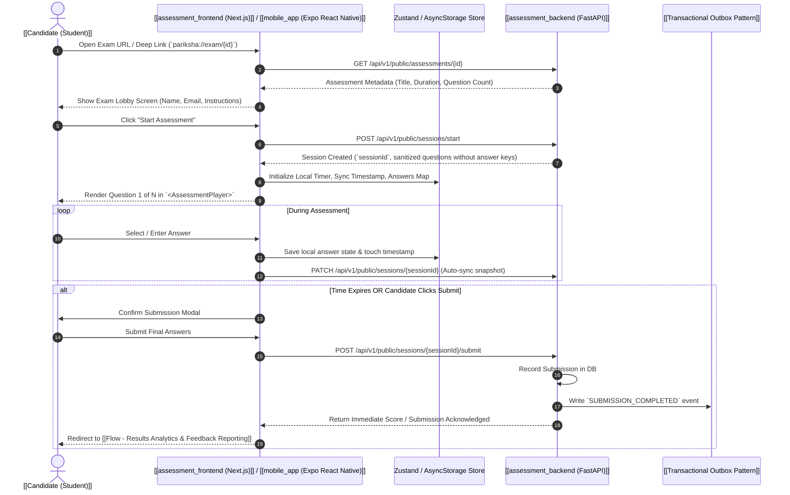

---
tags:
  - flow
  - delivery
  - exam-player
  - mobile
  - web
flow_id: FLOW-04
domain: Delivery
primary_persona: "[[Candidate (Student)]]"
services_involved:
  - "[[assessment_frontend (Next.js)]]"
  - "[[mobile_app (Expo React Native)]]"
  - "[[assessment_backend (FastAPI)]]"
  - "[[assessment_grading_worker]]"
status: active
---

# ⏱️ Flow: Exam Delivery & Live Assessment Player

## 1. Executive Summary
Covers the candidate experience from accessing the exam link/deep link, entering lobby details, taking the timed assessment across Web and Mobile apps, maintaining client-side timer persistence, and auto-submitting.

---

## 2. Sequence Diagram

---

## 3. Critical Client-Side Features & Safeguards

1. **Active Timer Resilience**:
   - Web uses `localStorage` timestamp offsets.
   - Mobile uses `AppState` listeners + `AsyncStorage` to ensure timers do not reset if the student switches apps or backgrounds their phone.
2. **5 Question Types Rendered**:
   - `MCQ_SINGLE`: Radio options with active highlight.
   - `MCQ_MULTIPLE`: Multi-select check toggles.
   - `TEXT_ENTRY`: Auto-focused text input.
   - `INLINE_CHOICE`: Inline pickers with WCAG AA 44px minimum touch targets.
   - `NUMERIC_ENTRY`: Number pad with float support (`step="any"`).
3. **Leave Confirmation**:
   - React Native `BackHandler` and Web `beforeunload` intercept unintended exits.

---

## 4. API Endpoints & Dual Delivery Models

### A. Public / Fast-Access Mode (`AssessmentSession`)
- `GET /api/v1/public/exams/{examId}` — Fetch public exam metadata.
- `POST /api/v1/public/sessions/start` (`PublicSessionStartRequest`) — Start candidate session.
- `PATCH /api/v1/public/sessions/{sessionId}` (`PublicSessionUpdateRequest`) — Real-time progress snapshot.
- `POST /api/v1/public/sessions/{sessionId}/submit` — Final submission.

### B. Enterprise / Authenticated Mode (`ExamAttempt`)
- `GET /api/v1/exams/{examId}` (`ExamDetailResponse`) — Institutional exam schema.
- `POST /api/v1/exams/{examId}/attempts/start` (`ExamAttemptStartRequest`) — Start verified student attempt.
- `POST /api/v1/exams/{examId}/attempts/{attemptId}/progress` (`ExamAttemptProgressRequest`) — Auto-save payload.
- `POST /api/v1/exams/{examId}/attempts/{attemptId}/submit` (`ExamAttemptSubmitRequest`) — Submit for grading.

## 5. Related Links
- Next Step: [[Flow - Async Scoring & Psychometric Evaluation]]
- Frontend Components: [[assessment_frontend (Next.js)]], [[mobile_app (Expo React Native)]]

