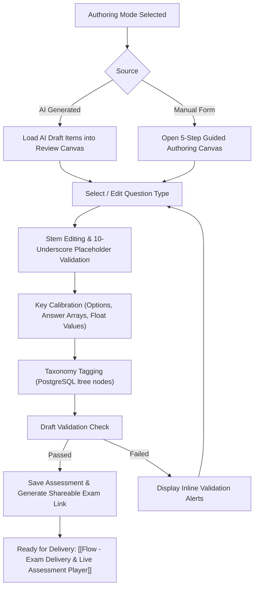

---
tags:
  - flow
  - authoring
  - review
flow_id: FLOW-02
domain: Authoring
primary_persona: "[[Faculty (Author)]]"
services_involved:
  - "[[assessment_frontend (Next.js)]]"
  - "[[assessment_backend (FastAPI)]]"
status: active
---

# ✍️ Flow: Manual Assessment Authoring & Refinement

## 1. Executive Summary
Provides faculty authors with a live canvas to create questions from scratch or edit, calibrate, and finalize AI-generated draft items before publishing exams.

---

## 2. Interactive Flowchart

---

## 3. Step-by-Step Functional Walkthrough

### 1. Mode Calibration & Walkthrough Tour
- The system activates the 4-panel Spotlight Overlay tour guiding the author through the stem, option configuration, taxonomy selection, and publish steps.

### 2. Standardized Question Types Handling
Authors can construct 5 standardized types:
- **`MCQ_SINGLE`**: Single correct radio choice.
- **`MCQ_MULTIPLE`**: Checkboxes with multiple correct answers.
- **`TEXT_ENTRY`**: Free-form text matching array of acceptable answer strings.
- **`INLINE_CHOICE`**: Inline dropdown embedded in `__________` with candidate options.
- **`NUMERIC_ENTRY`**: Exact or decimal numeric values (e.g. `3.14`).

### 3. Publishing & Exam Key Generation
- On clicking **"Save to Workspace & Publish"**, the frontend transmits the payload to `assessment_backend`.
- A unique `exam_id` (UUID) and public slug are provisioned.
- Deep link format: `pariksha://exam/{examId}` or `https://pariksha.app/exam/{examId}`.

---

## 4. API Endpoints
- `POST /api/v1/assessments/` — Create new assessment draft.
- `PUT /api/v1/assessments/{id}` — Update assessment questions and metadata.
- `POST /api/v1/assessments/{id}/publish` — Finalize and generate public share links.

## 5. Related Links
- Upstream: [[Flow - AI Assessment Generation (RAG & Gemini)]]
- Downstream: [[Flow - Exam Delivery & Live Assessment Player]]
- Standard: [[Standardized Question Types (EdTech)]]
