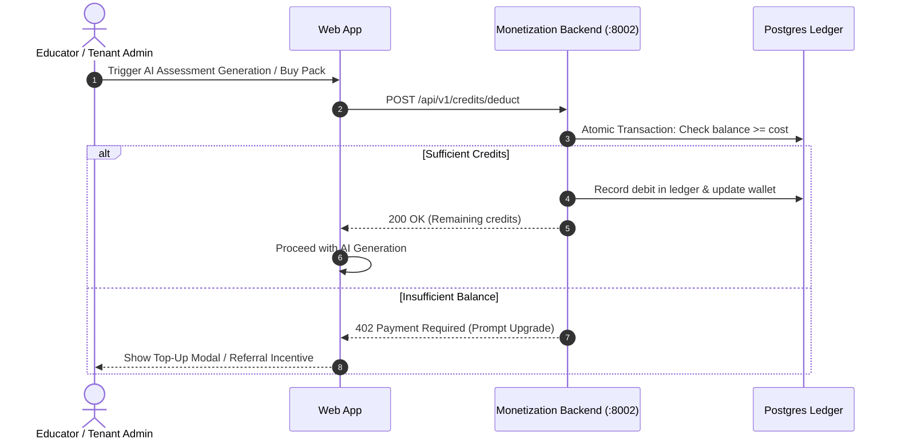

---
tags:
  - flow
  - monetization
  - wallet
  - referrals
flow_id: FLOW-08
domain: Monetization
primary_persona: "[[Tenant Administrator]]"
services_involved:
  - "monetization_backend"
  - "[[assessment_backend (FastAPI)]]"
status: active
---

# 💳 Flow: Monetization & Referral Wallet

## 1. Executive Summary
Manages AI credit consumption, institutional credit packages, educator referral rewards, and ledger accounting across assessment generation and scoring.

---

## 2. Sequence Diagram

---

## 3. Key Ledger Rules
- **Double-Entry Accounting**: Every credit granted or consumed has corresponding debit and credit ledger rows.
- **Referral Invariant**: Users who refer educators receive credit grants immediately upon the referred educator's first published assessment.

---

## 4. Related Links
- Component: [[assessment_backend (FastAPI)]]
- Persona: [[Tenant Administrator]], [[Faculty (Author)]]
