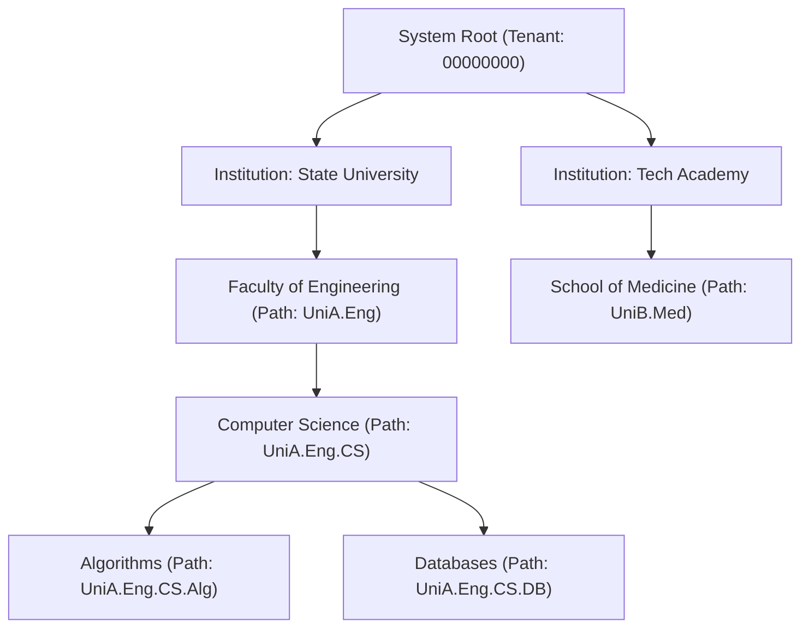

---
tags:
  - flow
  - taxonomy
  - multi-tenancy
  - ltree
flow_id: FLOW-07
domain: ControlPlane
primary_persona: "[[Tenant Administrator]]"
services_involved:
  - "[[control_plane (Management & Auth)]]"
  - "[[assessment_backend (FastAPI)]]"
status: active
---

# 🌳 Flow: Multi-Tenant Taxonomy & Hierarchy

## 1. Executive Summary
Organizes questions and assessments across institutional boundaries using PostgreSQL `ltree` hierarchical indexing for rapid parent/child traversals (e.g., `Science.Physics.Thermodynamics.CarnotCycle`).

---

## 2. Hierarchy Data Flow

---

## 3. PostgreSQL `ltree` Operators in Use
- Subtree Ancestor Query: `path @> 'UniA.Eng.CS'` (finds all items categorized in CS or its sub-topics).
- Descendant Query: `path <@ 'UniA.Eng'` (returns all engineering courses).
- Indexing: GIST index on `path` column delivers sub-millisecond lookups across millions of questions.

---

## 4. Related Links
- Related Component: [[control_plane (Management & Auth)]]
- Used In: [[Flow - AI Assessment Generation (RAG & Gemini)]], [[Flow - Manual Assessment Authoring & Refinement]]
