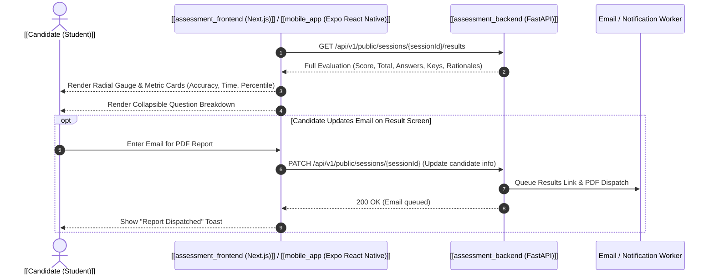

---
tags:
  - flow
  - analytics
  - results
  - reporting
flow_id: FLOW-06
domain: Analytics
primary_persona: "[[Candidate (Student)]]"
services_involved:
  - "[[assessment_frontend (Next.js)]]"
  - "[[mobile_app (Expo React Native)]]"
  - "[[assessment_backend (FastAPI)]]"
status: active
---

# 📈 Flow: Results Analytics & Feedback Reporting

## 1. Executive Summary
Provides candidates and educators with comprehensive post-exam scorecards, question-by-question breakdown, rationales/explanations, email dispatch, and cohort performance metrics.

---

## 2. Sequence Diagram

---

## 3. Key UI Components
- **Score Gauge**: Radial progress bar displaying score percentage and passing benchmark.
- **Accordion Breakdown (`ResultsBreakdown.tsx`)**:
  - Green / Red badges for correct/incorrect responses.
  - Full stem display with inline blanks filled.
  - Detailed pedagogical explanation for why the answer was correct.
- **Candidate Email Capture**: Allows anonymous users to retroactively link their email to receive permanent scorecards.

---

## 4. API Endpoints
- `GET /api/v1/public/sessions/{sessionId}/results` — Detailed student results.
- `GET /api/v1/assessments/{id}/analytics` — Faculty cohort-level distribution report.

## 5. Related Links
- Upstream: [[Flow - Async Scoring & Psychometric Evaluation]]
- Persona: [[Candidate (Student)]], [[Faculty (Author)]]
