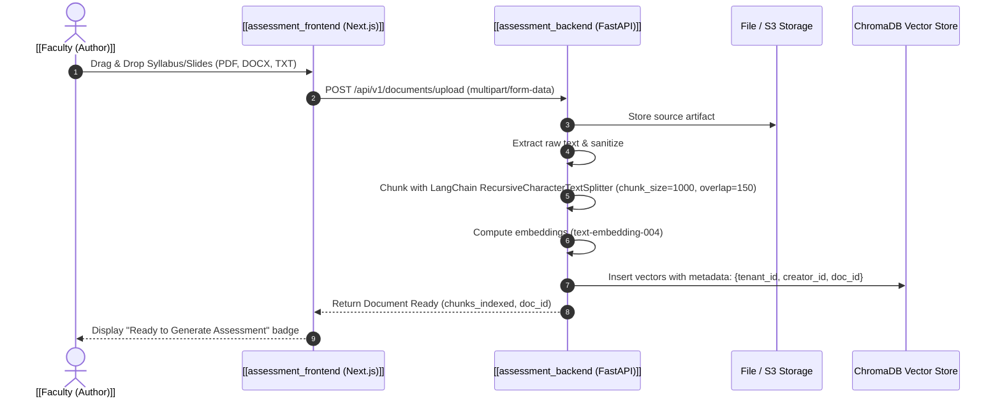

---
tags:
  - flow
  - rag
  - ingestion
  - documents
flow_id: FLOW-03
domain: Ingestion
primary_persona: "[[Faculty (Author)]]"
services_involved:
  - "[[assessment_frontend (Next.js)]]"
  - "[[assessment_backend (FastAPI)]]"
  - "[[ai_engine (Gemini + ChromaDB)]]"
status: active
---

# 📄 Flow: Secure Document Upload & Ingestion

## 1. Executive Summary
Handles the parsing, sanitization, recursive chunking, and vector embedding of PDFs, PPTXs, and DOCX curriculum documents into tenant-isolated ChromaDB collections.

---

## 2. Sequence Diagram

---

## 3. Key Technical Invariants
- **Multi-Tenant Isolation**: Vectors in ChromaDB are tagged with `tenant_id` to strictly prevent cross-tenant context leakage during retrieval.
- **Minimum Score Threshold**: Queries during RAG generation filter chunks with similarity $< 0.35$.
- **Supported File Types**: PDF, DOCX, TXT, Markdown.

---

## 4. API Endpoints & Models
- `POST /api/v1/public/documents/extract` (`UploadFile` $\rightarrow$ `ExtractionJobResponse`) — Multi-part document upload creating an async `ExtractionJob`.
- `GET /api/v1/public/documents/jobs/{job_id}` — Polling job status until extraction and chunk embedding complete.
- `POST /api/v1/documents/upload` — Authenticated faculty document repository ingestion.
- Database Entity: `Document` and `ExtractionJob` in `assessment_postgres`.

## 5. Related Links
- Next Step: [[Flow - AI Assessment Generation (RAG & Gemini)]]
- Component: [[ai_engine (Gemini + ChromaDB)]]

