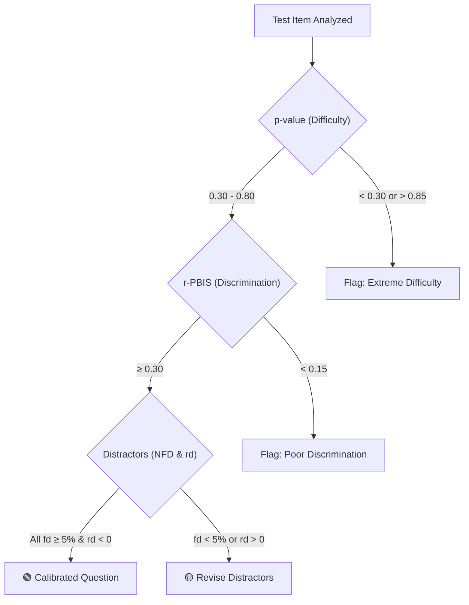

---
tags:
  - entity
  - psychometrics
  - analytics
  - edtech
---

# 📋 Psychometric Item Analysis ($p$-value & $r$-PBIS)

## Overview
Vatra Assess incorporates automated psychometric analytics calculated after student exam cohorts submit their attempts, validating question quality and detecting defective distractors.

---

## 1. Item Difficulty ($p$-value)
$$p = \frac{R}{N}$$
Where:
- $R$ = Total correct candidate responses.
- $N$ = Total attempts for this question.

### Interpretation Matrix:
| $p$-value Range | Classification | Faculty Recommendation |
| :--- | :--- | :--- |
| $> 0.85$ | Too Easy | Consider increasing distractor plausibility |
| $0.30 - 0.80$ | **Optimal Calibration** | Maintain in active question bank |
| $< 0.30$ | Highly Difficult | Review wording clarity or prerequisite teaching |

---

## 2. Point-Biserial Discrimination ($r$-PBIS)
$$r_{\text{pbis}} = \frac{\bar{X}_1 - \bar{X}_0}{s_X} \sqrt{\frac{N_1 N_0}{N^2}}$$
Where:
- $\bar{X}_1$ = Mean total exam score of candidates who answered this item correctly.
- $\bar{X}_0$ = Mean total exam score of candidates who answered incorrectly.
- $s_X$ = Standard deviation of total exam scores across all candidates.
- $N_1, N_0$ = Counts of candidates answering correctly and incorrectly.

### Interpretation Matrix:
| $r$-PBIS Range | Discrimination Power | Action |
| :--- | :--- | :--- |
| $\ge 0.30$ | **Strong Positive** | Retain item |
| $0.20 - 0.29$ | Moderate | Minor review |
| $0.00 - 0.19$ | Weak | Flag for review |
| $< 0.00$ | **Negative Discrimination** | **Critical Flag**: High performers failed; possible key error or misleading stem |

---

## 3. Distractor Efficiency & Non-Functioning Distractor (NFD) Analysis

In multiple-choice items (`MCQ_SINGLE`), distractors must be plausible alternatives that attract candidates who have not mastered the learning objective.

### Key Quality Thresholds:
1. **Selection Frequency Criterion ($f_{\text{distractor}}$)**:
   $$f_d = \frac{N_{\text{selected}}}{N_{\text{total}}} \times 100\%$$
   - **Functional Distractor**: Selected by $\ge 5\%$ of candidates.
   - **Non-Functioning Distractor (NFD)**: Selected by $< 5\%$ of candidates (too implausible or obvious). Items with 0 or 1 functional distractors are flagged for author revision.

2. **Distractor Discrimination ($r_{\text{distractor}}$)**:
   - Measures point-biserial correlation for each incorrect option.
   - **Standard**: $r_d$ **MUST be negative**. 
   - **Warning Flag**: If $r_d > 0$, top-performing candidates are choosing this incorrect option more often than bottom candidates, signaling a misleading or ambiguous distractor.

---

## 4. Item Health Summary Matrix

---

## Related Notes
- Evaluated In: [[Flow - Async Scoring & Psychometric Evaluation]]
- Displayed In: [[Flow - Results Analytics & Feedback Reporting]]
- Advanced Adaptive Modeling: [[Item Response Theory & Adaptive Testing (CAT)]]

