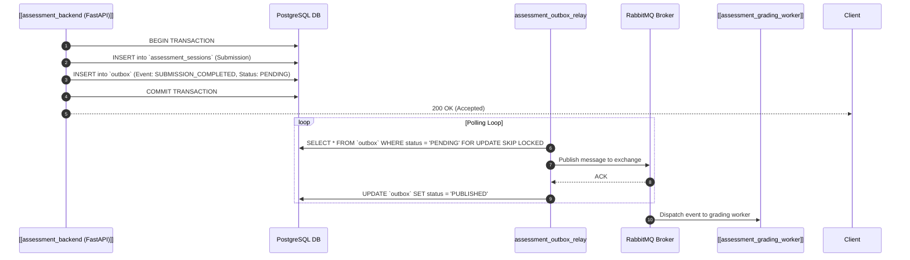

---
tags:
  - pattern
  - architecture
  - outbox
  - distributed-systems
---

# 📋 Transactional Outbox Pattern

## Problem Statement
In microservices, writing to a database and publishing an event to a message broker (RabbitMQ) within the same user request risks dual-write inconsistencies if the broker is momentarily unavailable or network partitions occur.

## Solution Architecture
Vatra Assess implements the **Transactional Outbox Pattern**:

## Guarantees
- **At-Least-Once Delivery**: No events are lost during server crashes or broker outages.
- **Strict Atomicity**: Submission records and outbox events commit together or roll back together.

## Related Flows
- [[Flow - Exam Delivery & Live Assessment Player]]
- [[Flow - Async Scoring & Psychometric Evaluation]]
